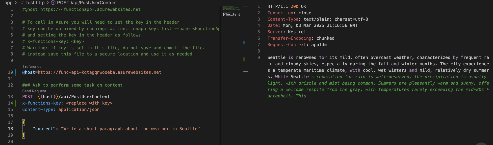

<!--
---
name: Azure Function using OpenAI TextCompletion input binding with Java
description: Azure Function using OpenAI TextCompletion input binding to send content to Azure OpenAI and get a result using Java
page_type: sample
products:
- azure-functions
- azure
- entra-id
urlFragment: azure-functions-completion-openai-java
languages:
- java
- bicep
- azdeveloper
---
-->

# Azure Function using OpenAI TextCompletion input binding with Java

[](https://codespaces.new/Azure-Samples/azure-functions-completion-openai-java)
[](https://vscode.dev/redirect?url=vscode://ms-vscode-remote.remote-containers/cloneInVolume?url=https://github.com/azure-samples/azure-functions-completion-openai-java)

This repository includes a Java Azure Functions app that uses the [Azure OpenAI text completion input binding](https://learn.microsoft.com/azure/azure-functions/functions-bindings-openai-textcompletion-input?tabs=isolated-process&pivots=programming-language-java) to send content to Azure OpenAI and get a result.

You can learn more about the OpenAI trigger and bindings extension in the [GitHub documentation](https://github.com/Azure/azure-functions-openai-extension) and in the [Official OpenAI extension documentation](https://learn.microsoft.com/en-us/azure/azure-functions/functions-bindings-openai).

You can opt in to have a VNet used in the sample by setting SKIP_VNET to true in the parameters.

* [Features](#features)
* [Getting Started](#getting-started)
  * [GitHub Codespaces](#github-codespaces)
  * [VS Code Dev Containers](#vs-code-dev-containers)
  * [Local environment](#local-environment)
* [Deploy to Azure](#deploy-to-azure)
* [Redeploy your code](#redeploy-your-code)
* [Using GitHub Actions](#using-github-actions)
* [Guidance](#guidance)
  * [Costs](#costs)
  * [Security Guidelines](#security-guidelines)
* [Resources](#resources)



## Features

* A Java based Azure Functions app that uses the OpenAI Text Completion input binding
* Open AI text completion's resulting text sent back on the function result

## Getting Started

You have a few options for getting started with this template. The quickest way to get started is [GitHub Codespaces](#github-codespaces), since it will setup all the tools for you, but you can also [set it up locally](#local-environment). You can also use a [VS Code dev container](#vs-code-dev-containers)

This template uses gpt-4o-mini which may not be available in all Azure regions. Check for [up-to-date region availability](https://learn.microsoft.com/azure/ai-services/openai/concepts/models#standard-deployment-model-availability) and select a region during deployment accordingly

  * We recommend using East US 2

### GitHub Codespaces

You can run this template virtually by using GitHub Codespaces. The button will open a web-based VS Code instance in your browser:

1. Open the template (this may take several minutes)
    [](placeholder)
2. Open a terminal window
3. Sign into your Azure account:

    ```shell
     azd auth login --use-device-code
    ```

4. [any other steps needed for your template]
5. Provision the Azure resources and deploy your code:

    ```shell
    azd up
    ```

6. (Add steps to start up the sample app)

### VS Code Dev Containers

A related option is VS Code Dev Containers, which will open the project in your local VS Code using the [Dev Containers extension](https://marketplace.visualstudio.com/items?itemName=ms-vscode-remote.remote-containers):

1. Start Docker Desktop (install it if not already installed)
2. Open the project:
    [](placeholder)
3. In the VS Code window that opens, once the project files show up (this may take several minutes), open a terminal window.
4. Sign into your Azure account:

    ```shell
     azd auth login
    ```

5. [any other steps needed for your template]
6. Provision the Azure resources and deploy your code:

    ```shell
    azd up
    ```

7. (Add steps to start up the sample app)

8. Configure a CI/CD pipeline:

    ```shell
    azd pipeline config
    ```

### Local environment

Prerequisites:

* [Java Developer Kit (JDK)](https://learn.microsoft.com/azure/developer/java/fundamentals/java-support-on-azure) version 17:
  * Other supported Java versions require updates to the pom.xml file.
  * The local `JAVA_HOME` environment variable must be set to the install location of the correct version of the JDK.
* [Apache Maven](https://maven.apache.org/), version 3.0 or above.
* [Azure Functions Core Tools v4.x](https://learn.microsoft.com/azure/azure-functions/functions-run-local?tabs=v4%2Cwindows%2Cnode%2Cportal%2Cbash)
* [Azure OpenAI resource](https://learn.microsoft.com/azure/openai/overview)
* [Azurite](https://github.com/Azure/Azurite)
* If using Visual Studio Code to run and debug locally:
  * [Visual Studio Code](https://code.visualstudio.com/)
  * [Azure Functions extension](https://marketplace.visualstudio.com/items?itemName=ms-azuretools.vscode-azurefunctions)

Run the following command to download the project code

```bash
azd init -t https://github.com/Azure-Samples/azure-functions-completion-openai-java
```

Enable scripts to create local settings file after deployment
Mac/Linux:

```bash
chmod +x ./infra/scripts/*.sh 
```

Windows:

```Powershell
set-executionpolicy remotesigned
```

Once you have your Azure subscription, run the following in a new terminal window to create Azure OpenAI and other resources needed:

```bash
azd provision
```

Alternatively, you can opt-in to have a VNet used in the sample. To do so, use `azd env` to configure `SKIP_VNET` to `false` before running `azd up`:

```bash
azd env set SKIP_VNET false
azd up
```

Take note of the value of `AZURE_OPENAI_ENDPOINT` which can be found in `./.azure/<env name from azd provision>/.env`.  It will look something like:

```bash
AZURE_OPENAI_ENDPOINT="https://cog-<unique string>.openai.azure.com/"
```

Alternatively you can [create an OpenAI resource](https://portal.azure.com/#create/Microsoft.CognitiveServicesTextAnalytics) in the Azure portal to get your key and endpoint. After it deploys, click Go to resource and view the Endpoint value.  You will also need to deploy a model, e.g. with name `completion` and model `gpt-4o-mini`.

Create local.settings.json (should be in the same folder as host.json). This will be created if you run azd provision:

```json
{
  "IsEncrypted": false,
  "Values": {
    "AzureWebJobsStorage": "UseDevelopmentStorage=true",
    "FUNCTIONS_WORKER_RUNTIME": "java",
    "AZURE_OPENAI_ENDPOINT": "<paste from above>",
    "CHAT_MODEL_DEPLOYMENT_NAME": "completion"
    }
}
```

Add the following permissions to the Azure OpenAI resource: <b>Cognitive Services OpenAI User</b> - give your user account access to the OpenAI resource if you did not create the OpenAI resource to test locally and the Azure Function App's Managed Identity when running in Azure. If you used `azd provision` this step is already done - your logged in user and your function's managed identity already have permissions granted.

#### Run your app using Maven

1. Open the folder in a new terminal.
1. From the `app` folder, run these commands to start the Functions host locally:

    ```bash
    mvn clean package
    mvn azure-functions:run
    ```

1. In the command palette (F1), type `Azurite: Start`, which enables debugging using local storage.
1. Open the [`test.http`](./app/test.http) project file, update the port on the `localhost` URL (if needed), and then use the built-in HTTP client to call the `PostUserContent` endpoint. This requires the [RestClient](https://marketplace.visualstudio.com/items?itemName=humao.rest-client) extension installed.

#### Run your app using Visual Studio Code

1. Open the folder in a new terminal.
1. Run the `code .` code command to open the project in Visual Studio Code.
1. In the command palette (F1), type `Azurite: Start`, which enables debugging using local storage.
1. Press **Run/Debug (F5)** to run in the debugger. Select **Debug anyway** if prompted about local emulator not running.
1. Open the [`test.http`](./app/test.http) project file, update the port on the `localhost` URL (if needed), and then use the built-in HTTP client to call the `PostUserContent` endpoint. This requires the [RestClient](https://marketplace.visualstudio.com/items?itemName=humao.rest-client) extension installed.

## Deploy to Azure

Run this command to provision the function app, with any required Azure resources, and deploy your code:

```shell
azd up
```

You're prompted to supply these required deployment parameters:

| Parameter | Description |
| ---- | ---- |
| _Environment name_ | An environment that's used to maintain a unique deployment context for your app. You won't be prompted if you created the local project using `azd init`.|
| _Azure subscription_ | Subscription in which your resources are created.|
| _Azure location_ | Azure region in which to create the resource group that contains the new Azure resources. Only regions that currently support the Flex Consumption plan are shown.|

After publish completes successfully, `azd` provides you with the URL endpoints of your new functions, but without the function key values required to access the endpoints. To learn how to obtain these same endpoints along with the required function keys, see [Invoke the function on Azure](https://learn.microsoft.com/azure/azure-functions/create-first-function-azure-developer-cli?pivots=programming-language-dotnet#invoke-the-function-on-azure) in the companion article [Quickstart: Create and deploy functions to Azure Functions using the Azure Developer CLI](https://learn.microsoft.com/azure/azure-functions/create-first-function-azure-developer-cli?pivots=programming-language-dotnet).

## Redeploy your code

You can run the `azd up` command as many times as you need to both provision your Azure resources and deploy code updates to your function app.

>[!NOTE]
>Deployed code files are always overwritten by the latest deployment package.

## Using GitHub Actions

The `azure-dev` GitHub Actions workflow is a CI/CD workflow that will attempt to provision and deploy this solution. Before it can work you need to set up your fork of this repo with the following instructions.

1. Clone your fork locally

`
git clone https://github.com/Azure-Samples/azure-functions-completion-openai-java
`

2. In the local repository folder, run:

`
azd pipeline config
`

3. Follow the prompts to configure the pipeline with your Azure account and subscription.

## Guidance

### Costs

Pricing varies per region and usage, so it isn't possible to predict exact costs for your usage.
The majority of the Azure resources used in this infrastructure are on usage-based pricing tiers.

* Azure OpenAI Service: S0 tier, ChatGPT model. Pricing is based on token count. [Pricing](https://azure.microsoft.com/pricing/details/cognitive-services/openai-service/)
* Azure Functions: Flex Consumption tier with 2GB instance memory size. Pricing is based on resource allocation, and each month allows for a certain amount of free usage. [Pricing](https://azure.microsoft.com/pricing/details/functions) and [Consumption-based costs](https://learn.microsoft.com/azure/azure-functions/functions-consumption-costs?tabs=flex-consumtion-plan%2Cportal#consumption-based-costs) explanation.
* Azure Storage Account: Standard tier. [Blob storage pricing](https://azure.microsoft.com/pricing/details/storage/blobs/), [Queue storage pricing](https://azure.microsoft.com/pricing/details/storage/queues/), and [Table storage pricing](https://azure.microsoft.com/pricing/details/storage/tables/).
* Log analytics and Application Insights: Pay-as-you-go tier. Costs based on data ingested. [Pricing](https://azure.microsoft.com/pricing/details/monitor/)

⚠️ To avoid unnecessary costs, remember to take down your app if it's no longer in use,
either by deleting the resource group in the Portal or running `azd down --purge` (--purge does not leave a soft delete of AI resource and recovers your quota).

### Security Guidelines

This template uses [Managed Identity](https://learn.microsoft.com/entra/identity/managed-identities-azure-resources/overview) for authenticating to the Azure OpenAI service.

To ensure continued best practices in your own repository, we recommend that anyone creating solutions based on our templates ensure that the [Github secret scanning](https://docs.github.com/code-security/secret-scanning/about-secret-scanning) setting is enabled.

You may want to consider additional security measures, such as:

* Setting SKIP_VNET to false will create a virtual network and private endpoints between the services to further secure the solution:

```bash
azd env set SKIP_VNET false
azd up
```

## Resources

* [Azure Functions Flex Consumption plan hosting](https://learn.microsoft.com/azure/azure-functions/flex-consumption-plan)
* [Azure OpenAI extension for Azure Functions](https://learn.microsoft.com/azure/azure-functions/functions-bindings-openai?tabs=isolated-process&pivots=programming-language-java)
